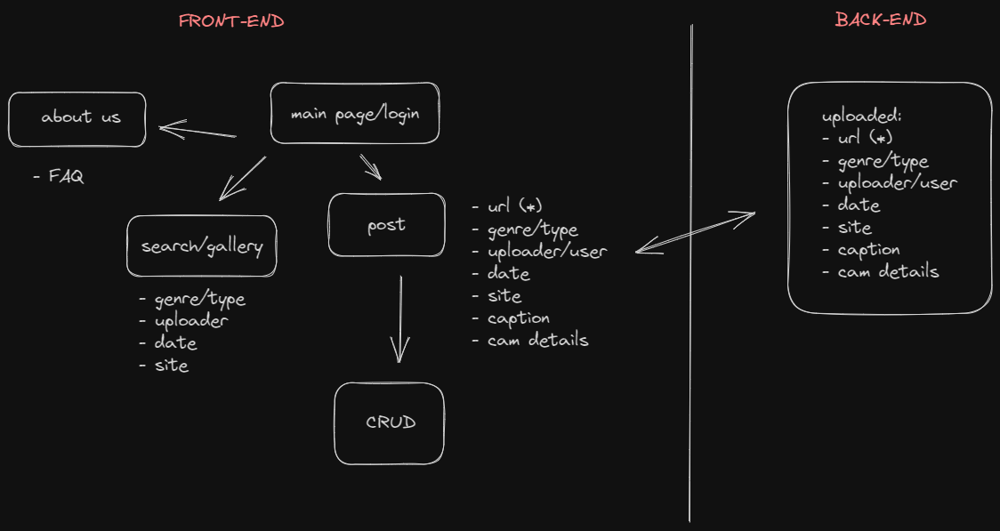
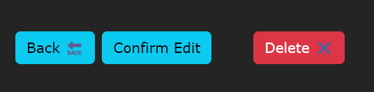

Frontend for Project 2 done in JavaScript.  
Hosted on Netlify (https://www.netlify.com)  
Have a look here: https://chic-pastelito-86f477.netlify.app/

It is a simple representation of image posting sites such as Instagram and Imgur,
where users can share a photo/picture/meme (a link in the case of this project)
along with certain details.
The objective was to create a clean and simple interface to post image media, and
to view those contributed by others.
Firebase is not implemented properly at the moment and I hope to circle back in future.
That will give users the ability to access their own profile, along with being
able to check their past posts.

Technologies/libraries used:

- react (with vite) (https://vitejs.dev/)
- bootstrap
- axios
- firebase (not fully implemented as of 22/8/2023)

Entity Relationship Diagram:

Users are able to view and edit (perform CRUD functions, i.e.
create, read, update and delete) on posts, by navigating to the gallery and
clicking on specific posts.

Users are also able to search for posts by tags (more functionality to be added in future,
for example, date added, within captions, etc) for sorting purposes in the search field right
at the top of the gallery page.

Four months ago, if you told me I would be able to build something like this,
however rudimentary, I would not have believed you. Yet here in the later half of 2023,
we have the technology and tools available to build it, almost all of which are readily
available free-of-charge and maintained by the community, with instructions on how to do so
to boot.

Many thanks to the community for the gracious use of these tools and also teachers both online and off. Special shout-out to Edison for the file layout/organization tips and YS for guiding
through deployment.
